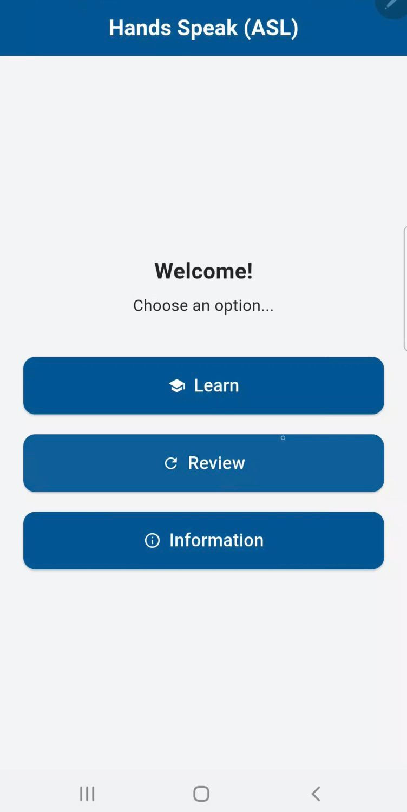
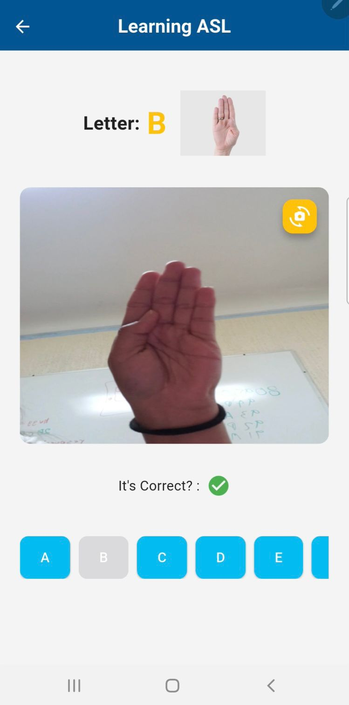
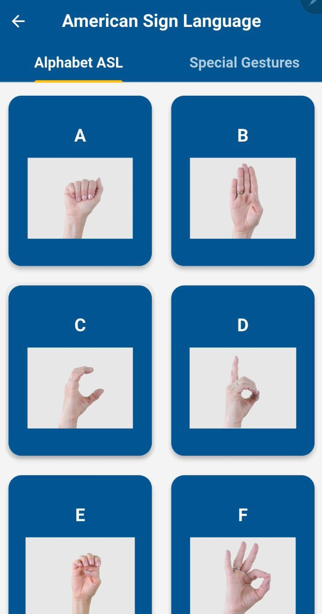

# ASL_APP - Aprende Lengua de Señas Americana

**ASL_APP** es una aplicación educativa desarrollada en Flutter que permite a los usuarios aprender el alfabeto de la **Lengua de Señas Americana (ASL)** de forma interactiva y visual. Ideal para principiantes, educadores y cualquier persona interesada en aprender ASL.

---

## 📱 Características

### 🧠 Modo de Aprendizaje
- Aprende cada letra del alfabeto en ASL mediante una combinación de:
  - 📷 Detección de señas con cámara en tiempo real.
  - 🖼 Imágenes representativas de cada letra.
  - 🔄 Retroalimentación instantánea al detectar correctamente una seña.

### 📝 Modo de Revisión
- Elige aleatoriamente 5 letras para practicar lo aprendido.
- El sistema te muestra la letra y evalúa si realizas la seña correctamente usando visión por computadora.

### ℹ️ Sección de Información
- Accede a un catálogo visual con:
  - 📷 Imagen de cada letra y gesto especial.
  - 🎥 Video demostrativo.
  - 📝 Descripción detallada para realizar la seña correctamente.

---

## 🔧 Tecnologías Utilizadas

- **Flutter** – Framework principal de desarrollo.
- **Camera & Video Player** – Para vista previa y reproducción de gestos.
- **MediaPipe + OpenCV** (vía backend Python) – Para el reconocimiento de señas en tiempo real.
- **FastAPI** – API que procesa imágenes y devuelve la letra detectada.
- **Provider** – Para el manejo eficiente del estado en Flutter.

### Home Screen

### Modo de Aprendizaje

### Información de Letras y Gestos

### Integrantes:
- Elorza Velásquez Jorge Aurelio
- Frida Ximena Martínez Lorenzo

---
